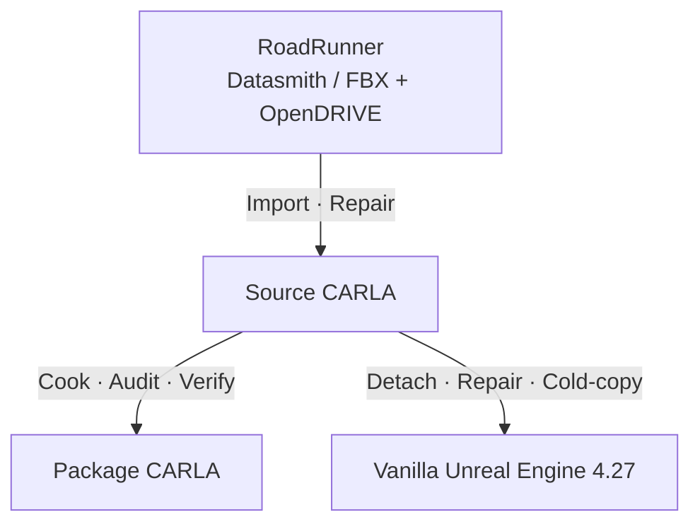
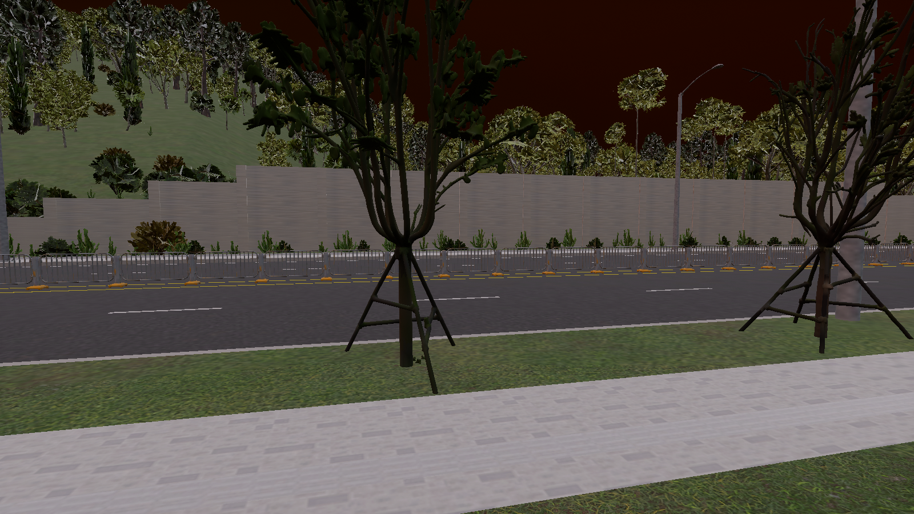
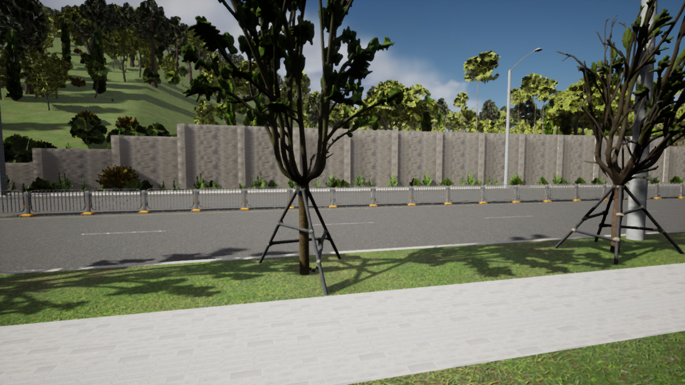

# CARLA Map Migration Toolkit

Codex Plugin + CLI tooling for inspecting, planning, repairing and validating
custom CARLA maps across RoadRunner, Source CARLA, Package CARLA and vanilla
Unreal Engine 4.27.

[](https://github.com/A1eeeeex/carla-map-migration-toolkit/actions/workflows/logic-tests.yml)
[Apache-2.0](LICENSE) · Experimental · [中文](README.zh-CN.md)



## Why this exists

A CARLA custom map can look correct in the Editor while OpenDRIVE (XODR),
waypoints, spawn points or traffic still need checking. A working Source CARLA
map does not guarantee a complete cooked Package CARLA map. Moving assets to
vanilla UE4.27 adds dependency, material, reference, collision and lighting checks.

This toolkit turns those recurring tasks into route-specific Codex workflows
and reusable host tooling: inspect inputs, seal plans, audit packages, produce
delivery manifests, compare performance and record structured evidence. It is
more than prompts, without treating a script check as an engine operation.
Try the [engine-free script example](demo/quickstart/README.md) before supplying a map.

## Choose your route

| Your task | Route guide |
|---|---|
| Import a RoadRunner export into editable Source CARLA | [Import and repair](docs/routes/roadrunner-to-source-carla.md) |
| Build and validate a map for matching Package CARLA | [Cook and package](docs/routes/source-carla-to-package-carla.md) |
| Remove CARLA dependencies and deliver to vanilla UE4.27 | [Migrate and cold-copy](docs/routes/source-carla-to-ue427.md) |

Shared guidance covers materials, textures, references, collision, daylight,
Content-only delivery and staged performance optimization. Host scripts audit
archives, generate SHA256 manifests and report performance gains and regressions.
The [capability checklist](docs/capabilities.md) separates automation from Editor work.

## Install

Tested baseline: Ubuntu 22.04 x86_64, Python 3.10.12 and Codex CLI 0.153.4.
See [installation](docs/installation.md) for version checks and setup details.
Install the complete Plugin, not a single Skill folder: the three Skills share
scripts, schemas and references. Setup uses the `shell-build` context.

```bash
git clone https://github.com/A1eeeeex/carla-map-migration-toolkit.git
cd carla-map-migration-toolkit
python3.10 -m venv .venv
.venv/bin/python -m pip install --requirement requirements-runtime.txt
codex plugin marketplace add . --json
codex plugin add carla-map-migration-toolkit@carla-map-migration-toolkit --json
source .venv/bin/activate
codex
```

## Use with Codex

Choose one request, provide your input location, and start with inspection:

```text
Use $carla-map-migration-toolkit:roadrunner-to-source-carla. Inspect my RoadRunner export and plan its import into Source CARLA. Do not modify anything yet.
```

```text
Use $carla-map-migration-toolkit:source-carla-to-package-carla. Inspect my Source CARLA handoff and plan a matching content package. Do not build or install yet.
```

```text
Use $carla-map-migration-toolkit:source-carla-to-ue427. Inspect my Source CARLA map and plan delivery to clean UE4.27, including a second clean-project cold-copy. Do not modify anything yet.
```

No engine or map available? In a separate terminal at the clone root, try the
[engine-free script example](demo/quickstart/README.md):

```bash
demo_root="$(mktemp -d -t cmtk-quickstart.XXXXXX)"
.venv/bin/python demo/quickstart/run_demo.py --workspace-root "$demo_root"
```

Expected: `demo_status: PASS`, `route_validation_status: NOT_RUN`.
The example checks planning logic, not a real map import. There is currently no
public, downloadable real-map demo.

## What is automated?

The Plugin includes three route-specific Codex Skills. Its shared CLI, JSON
schemas and evidence checks are also usable directly. v0.1 distributes the
complete Plugin, not a standalone PyPI package.

| Capability | Host tooling | Editor / engine checkpoint |
|---|---|---|
| Workspace and input checks | `inspect` | Verify declared versions and live facts |
| Plan creation and integrity | `plan`, `verify-plan` | No asset changes executed |
| Archive, Content and manifests | `archive-audit`, `content-audit`, `map-package-audit`, `delivery-manifest` | No Cook or binary-reference inspection |
| Performance comparisons | `compare-metrics`, `compare-performance` | Collect matched samples and validate changes |
| Dataprep Import / Execute / Commit; asset repairs | Guided workflow | Required Editor / Unreal API work |
| CARLA runtime, PIE and cross-project checks | `record-stage-evidence` validates supplied receipts | Required CARLA / Unreal execution |

`validate` creates a pending report; it returns `NOT_RUN` without engine
evidence, not an automatic runtime test. See [capabilities](docs/capabilities.md).

## What has been verified?

Hosted CI checks structure, host logic and synthetic fixtures, not engine execution.
Commit-bound results are in [current status](docs/current-status.md).
All three routes also have historical real-use records, including second-project
UE4.27 checks and Content-only delivery. Coverage is case-specific, not a guarantee
for every map or version. Complete end-to-end evidence under the toolkit's current
verification format is still missing; this remains experimental, not a certified RC.

See [evidence and compatibility](docs/current-status.md) for records and gaps.
Inspection and planning are the default. Asset changes require explicit approval,
engine-aware backups and validation; high-risk optimizations require review.
This repository includes no customer maps, XODR or engine binaries.

## Why CARLA 0.9.x / UE4.27?

The observed primary stack is RoadRunner R2025a, CARLA 0.9.16, Source UE 4.26.2
and vanilla UE4.27.2. This deliberately scopes the custom-map workflow; it is
not a universally verified compatibility matrix.
[CARLA 0.10.0 introduced its UE5.5 stack](https://carla.org/2024/12/19/release-0.10.0/).
The 0.9.x evidence does not transfer automatically to that route. CARLA 0.10 / UE5
research is [backlog](docs/release/github-settings-checklist.md#backlog), not current support.

## Troubleshooting

Missing waypoints, a map absent after Cook, black materials in UE4.27, or slower
performance after optimization? Start with the [symptom-based cookbook](docs/troubleshooting/README.md)
for CLI commands, Editor checkpoints and evidence to keep.

<!-- GOLDEN_MAP_SHOWCASE_START -->
## Real-map showcase

An anonymized real-use case shows migration into UE4.27, sky/material repairs,
and rollback of a LOD candidate that did not improve overall performance.

| Before repairs | After repairs |
|---|---|
|  |  |

[Read the migration, repair and performance case (Chinese)](docs/cases/source-carla-to-ue427.zh-CN.md).
Historical, case-specific evidence; screenshots are not performance measurements.
No public downloadable real-map demo is available yet. The maintainer will supply future input;
the [Golden Map onboarding framework](development/shared/plans/golden-map/README.md)
defines rights, inputs, validation and media capture. The runnable script example
uses synthetic text, not a map migration.
<!-- GOLDEN_MAP_SHOWCASE_END -->

## Documentation

- [Installation](docs/installation.md) · [Script example](demo/quickstart/README.md) · [Capabilities](docs/capabilities.md) · [Evidence](docs/current-status.md)
- [Known limitations](KNOWN_LIMITATIONS.md) — unsupported behavior and implementation gaps
- [Contributing](CONTRIBUTING.md) — development setup and change guidelines
- [Development reference index](development/shared/README.md) — design, evidence rules and historical reports
- [Changelog](CHANGELOG.md) — development and release history

Contributors and maintainers: see [release preparation](docs/release/github-settings-checklist.md) and the development reference index.

<details>
<summary>Developer commands and direct CLI example</summary>

Run tests from the clone root:

```bash
.venv/bin/python -m pip install --requirement requirements-dev.txt
PYTEST_DISABLE_PLUGIN_AUTOLOAD=1 PYTHONDONTWRITEBYTECODE=1 \
  .venv/bin/python -m pytest -q -p no:cacheprovider
```

Direct inspection runs in `host-cpython`:

```bash
CMTK_EXECUTION_CONTEXT=host-cpython .venv/bin/python \
  plugins/carla-map-migration-toolkit/scripts/cmtk.py inspect \
  --route roadrunner-to-source-carla \
  --config plugins/carla-map-migration-toolkit/examples/map-workspace.example.json
```

The example uses illustrative paths. Copy and adapt it to your allowed roots;
otherwise `BLOCKED` is expected. See [installation](docs/installation.md).

</details>

---

## License and contact

[Apache-2.0](LICENSE) · [Notice](NOTICE.md) · [Citation](CITATION.cff) · Maintainer [@A1eeeeex](https://github.com/A1eeeeex).
The license covers original project material, not third-party maps or engines.
This is an independent community project, not affiliated with or endorsed by
CARLA, Epic Games or MathWorks RoadRunner. Follow [SECURITY.md](SECURITY.md)
for security reports; do not disclose sensitive details in public issues.

If this toolkit helps your CARLA map workflow, feedback, issues and contributions are welcome.
