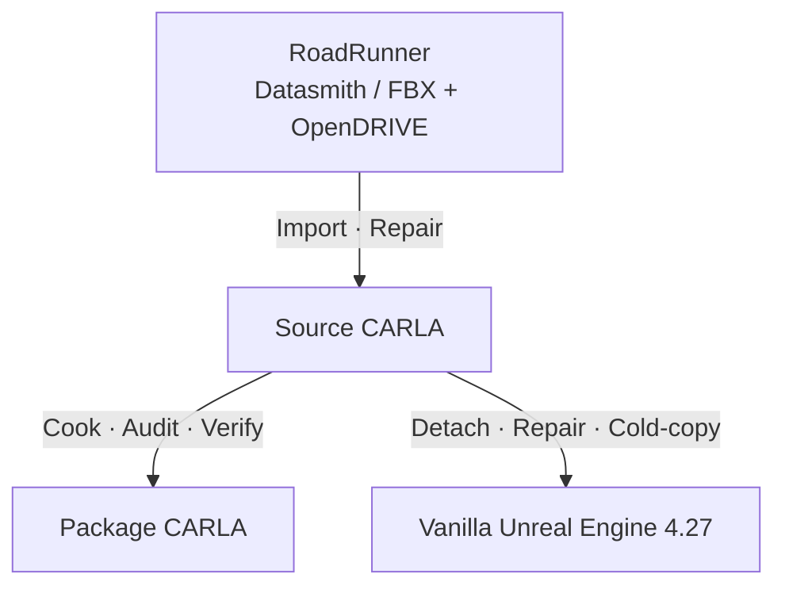

# CARLA 地图迁移工具包

Codex Plugin + CLI 工具，帮助你在 RoadRunner、Source CARLA、Package CARLA
和原版 Unreal Engine 4.27 之间检查、规划、修复、验证与交付自定义地图。

[](https://github.com/A1eeeeex/carla-map-migration-toolkit/actions/workflows/logic-tests.yml)
[Apache-2.0](LICENSE) · Experimental · [English](README.md)



## 为什么需要这个工具包？

地图在编辑器里看起来正常，不等于 CARLA 的 OpenDRIVE（XODR）、waypoints、
spawn 或交通功能正常；Source CARLA 能打开，也不代表 Cook 后的 Package CARLA
能完整加载。迁移到原版 UE4.27 时，还需要检查 CARLA 类依赖、材质、引用、
碰撞和光照。每次手工排查，容易漏项，也难以说清到底验证了什么。

工具包把这些经验组织为三条路线的 Codex 工作流，并提供可独立运行的主机脚本：
检查输入、封存计划、审计包体、生成交付清单、比较性能、记录结构化证据。
不是只有 Prompt；也不会把脚本检查冒充引擎操作。没有地图也能先试
[无需引擎的脚本示例](demo/quickstart/README.md)。

<!-- GOLDEN_MAP_SHOWCASE_START -->
## 真实迁移案例

一个历史 Source CARLA → vanilla UE4.27 案例：迁移地图及依赖，
修复天空与材质，检查干净项目，并回滚没有整体收益的 LOD 候选。

| 修复前 | 修复后 |
|---|---|
|  |  |

[查看完整案例](docs/cases/source-carla-to-ue427.zh-CN.md)。
这是单个历史案例；截图展示外观，不证明性能或普遍兼容性。
可下载的 [Golden Map](development/shared/plans/golden-map/README.md) 仍在计划中，与本案例独立。
<!-- GOLDEN_MAP_SHOWCASE_END -->

## 选择你要做的事

| 你的目标 | 使用指南 |
|---|---|
| 把 RoadRunner 导出地图放进 Source CARLA 编辑 | [导入与修复](docs/routes/roadrunner-to-source-carla.md) |
| 把 Source 地图打包，交给匹配的发行版 CARLA | [Cook 与打包](docs/routes/source-carla-to-package-carla.md) |
| 去除 CARLA 依赖，交付给原版 UE4.27 | [迁移与干净复制验收](docs/routes/source-carla-to-ue427.md) |

三条路线共享材质、贴图、引用、碰撞、晴天显示、Content-only 交付和分阶段
性能优化指引。脚本可以审计压缩包、生成 SHA256 文件清单，并如实列出性能
改善与退化。哪些自动完成、哪些需要编辑器操作，见[能力清单](docs/capabilities.md)。

## 安装

已测试环境：Ubuntu 22.04 x86_64、Python 3.10.12、Codex CLI 0.153.4。
版本检查与详细步骤见[安装说明](docs/installation.md)。请安装完整 Plugin，
不要只复制某个 Skill 文件夹；三项 Skill 需要共享脚本、格式定义和参考资料。
以下安装命令使用 `shell-build` 上下文。

```bash
git clone https://github.com/A1eeeeex/carla-map-migration-toolkit.git
cd carla-map-migration-toolkit
python3.10 -m venv .venv
.venv/bin/python -m pip install --requirement requirements-runtime.txt
codex plugin marketplace add . --json
codex plugin add carla-map-migration-toolkit@carla-map-migration-toolkit --json
source .venv/bin/activate
codex
```

## 在 Codex 中使用

选一条请求，补充你的输入文件位置，从只读检查开始：

```text
Use $carla-map-migration-toolkit:roadrunner-to-source-carla. 检查我的 RoadRunner 导出文件，规划导入 Source CARLA。先不要修改文件。
```

```text
Use $carla-map-migration-toolkit:source-carla-to-package-carla. 检查我的 Source CARLA 交接资料，规划匹配平台的地图内容包。先不要构建或安装。
```

```text
Use $carla-map-migration-toolkit:source-carla-to-ue427. 检查我的 Source CARLA 地图，规划交付到干净 UE4.27，并安排第二个干净项目的复制验收。先不要修改文件。
```

没有引擎和地图也可以试用。在另一个终端进入克隆目录，运行
[无需引擎的脚本示例](demo/quickstart/README.md)：

```bash
demo_root="$(mktemp -d -t cmtk-quickstart.XXXXXX)"
.venv/bin/python demo/quickstart/run_demo.py --workspace-root "$demo_root"
```

预期输出：`demo_status: PASS`、`route_validation_status: NOT_RUN`。
意思是计划逻辑检查通过，真实地图导入没有执行，不是报错。
目前没有可供下载、在引擎中复现的公开真实地图 Demo。

## 哪些自动完成？

Plugin 包含三项路线 Skill；共享 CLI、JSON Schema 和证据检查也可直接使用。
v0.1 的正式分发单位仍是完整 Plugin，不是 PyPI 包。

| 能力 | 主机工具 | 编辑器 / 引擎环境 |
|---|---|---|
| 工作区、路径和输入检查 | `inspect` 自动检查声明的输入 | 实际版本和资产事实仍需核实 |
| 生成与校验计划 | `plan` / `verify-plan` | 不执行资产改动 |
| 包体、Content 和文件清单 | `archive-audit` / `content-audit` / `map-package-audit` / `delivery-manifest` | 不执行 Cook 或解读二进制引用 |
| 性能数据比较 | `compare-metrics` / `compare-performance` | 采样、优化和功能复验需引擎 |
| Dataprep 导入与提交、资产修复 | 提供操作与故障指引 | 需要编辑器 / Unreal API |
| Runtime、PIE 与跨项目复制验收 | `record-stage-evidence` 记录并校验提供的证据 | 需要相应 CARLA / Unreal 环境 |

`validate` 生成待验证报告；没有引擎证据时返回 `NOT_RUN`，不是自动实机测试。
详细范围见[能力清单](docs/capabilities.md)。

## 实际验证到什么程度？

主机 CI 覆盖结构、脚本逻辑和模拟数据，不执行引擎验证。
绑定提交的测试结果统一见[当前状态](docs/current-status.md)。
三条路线也都有历史实操记录，包括第二个 UE4.27 项目检查和 Content-only
交付。但这些是特定案例，不代表所有地图和版本都兼容；按工具包现行格式记录
的完整端到端证据仍未齐，因此当前是实验版，不是已严格验收的 RC。

实测范围与缺口统一见[当前状态](docs/current-status.md)。默认先检查、再规划；
修改资产需明确授权、引擎适用的备份和实际验证，高风险优化需要审查。
仓库不提供客户地图、XODR 或引擎二进制。

## 为什么仍然是 CARLA 0.9.x / UE4.27？

当前观察到的主要环境是 RoadRunner R2025a、CARLA 0.9.16、Source UE 4.26.2
和原版 UE4.27.2。这是有意限定的自定义地图工程范围，不是全版本兼容认证。
[CARLA 0.10.0 官方发布说明](https://carla.org/2024/12/19/release-0.10.0/)
介绍了 UE5.5 路线；现有 0.9.x 案例不能直接外推到它。0.10 / UE5 支持需要
独立研究和验证，目前只在[后续计划](docs/release/github-settings-checklist.md#backlog)中。

## 故障排查

地图有画面却没有 waypoints、Cook 后地图缺失、UE4.27 黑材质或性能退化？
从[故障指南](docs/troubleshooting/README.md)按症状查找命令、编辑器检查点和验收边界。

## 文档导航

- [安装](docs/installation.md) · [脚本示例](demo/quickstart/README.md) · [能力清单](docs/capabilities.md) · [实测范围](docs/current-status.md)
- [已知限制](KNOWN_LIMITATIONS.md)：尚未实现或不支持的行为
- [贡献指南](CONTRIBUTING.md)：开发环境与修改要求
- [开发参考索引](development/shared/README.md)：设计、证据规则和历史报告
- [更新记录](CHANGELOG.md)：开发与版本历史

贡献者与维护者另见[发布准备](docs/release/github-settings-checklist.md)和开发参考索引。

<details>
<summary>开发者测试命令</summary>

在克隆目录运行：

```bash
.venv/bin/python -m pip install --requirement requirements-dev.txt
PYTEST_DISABLE_PLUGIN_AUTOLOAD=1 PYTHONDONTWRITEBYTECODE=1 \
  .venv/bin/python -m pytest -q -p no:cacheprovider
```

不通过 Codex 调用的 `host-cpython` 命令示例见英文首页和安装说明。

</details>

---

## 许可与联系

[Apache-2.0](LICENSE) · [署名声明](NOTICE.md) · [引用信息](CITATION.cff) · 维护者 [@A1eeeeex](https://github.com/A1eeeeex)。
许可证仅覆盖本项目有权发布的原创材料，不授予第三方地图或引擎的使用权。
本项目独立于 CARLA、Epic Games 和 MathWorks RoadRunner，不代表官方或获得
其背书。安全问题请遵循 [SECURITY.md](SECURITY.md)，不要在公开 Issue 披露敏感细节。

欢迎反馈实际地图工作流中的问题、兼容性记录和改进建议；请先脱敏再分享。
