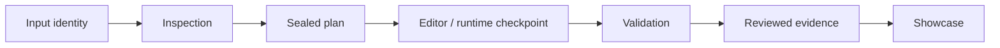

# Golden Map evidence checklist

Reuse the existing contracts. This checklist is not a new schema, a validator
implementation or an acceptance waiver.

- [ ] Bind input hashes, exact Toolkit commit, route, Profile, tool versions and target identity.
- [ ] Retain inspection, sealed plan/hash, backups, approved changes and rollback metadata.
- [ ] Record each check in its actual context with observations, not exit code alone.
- [ ] Use [adapter receipts](../../../../docs/evidence-adapters.md), existing stage/check
  schemas and [acceptance contracts](../../../../docs/acceptance-contracts.md).
- [ ] Bind underlying artifact paths and hashes, schema versions and review/signoff.
- [ ] Preserve PASS, FAIL, BLOCKED and NOT_RUN. REVIEW_REQUIRED is a review gate,
  not a substitute for a passed runtime check.
- [ ] Keep screenshots supplementary to structured load/reference/collision/drive checks.
- [ ] For UE4.27, independently identify the receiver and repeat cold-copy gates.
- [ ] For Package, bind archive identity to installation and independent runtime results.
- [ ] For performance, pin hardware, resolution, quality, camera, traffic, sensors,
  VSync/cap and protected properties; report frame time, FPS and regressions.
- [ ] Scan the full public evidence envelope, not only the visible summary.
- [ ] Publish no complete Verified Run until every required current-contract check passes.

## First unlocks after real input arrives

A rights-approved input enables real Editor observations (L3); the corresponding
runtime/PIE checks can establish their L4 scope. Independent receiver/portability
checks can establish L5 where required. Input availability alone unlocks none
of these claims. Other routes remain NOT_RUN until actually executed.

Public evidence belongs under the route-specific
[evidence area](../../../../evidence/verified/README.md) after review. Keep the
manifest planned until a reviewed update can cite real evidence; never pre-fill
`verified_environments` with the intended stack.
